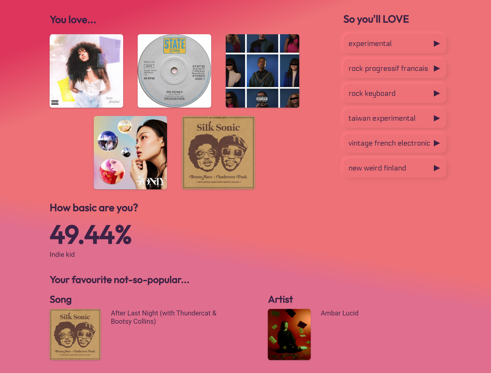

# Spoopify

A website to recommend music you'll hate based on your Spotify listening activity. Uses the latest and greatest in for-loop technology.

🔗[spoopify.me](https://spoopify.me)

Disclaimer: No personal data is stored. Feel free to look through the code for your peace of mind.

## Nitty Gritty
A genre map containing genres and their most dissimilar genres is created by scrapping [Every Noice at Once](https://everynoise.com/) every few months.

The user's top songs and artists are retrieved from Spotify.

Their top genres and consequently the opposite of those genres are computed to show their "least favourite" genres.